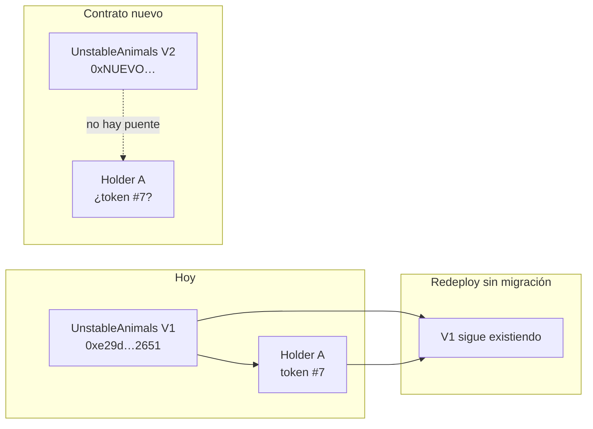
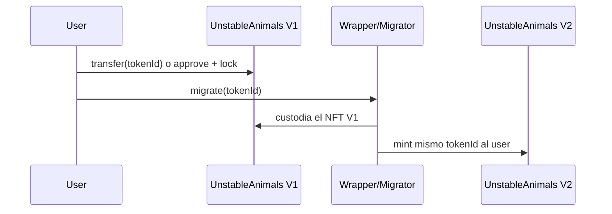

# Exploración: modernizar / redeploy del contrato Unstable Animals

Rama de simulación: `cursor/contract-v2-exploration-eb02`  
Contrato actual (mainnet): `0xe29d2d356bffE827E4Df3B6cA9Fdc9819C3e2651`  
Estado on-chain (jun 2026): ~44 minted, venta activa, precio 0.03 ETH

> **Esta rama es solo exploración.** No hay deploy planificado. El frontend y producción siguen apuntando al contrato V1.

---

## Respuesta corta

| Pregunta | Respuesta |
|----------|-----------|
| ¿Redeploy “limpio” sin perder NFTs? | **No.** Un contrato nuevo tiene otra dirección. Los 44 NFTs existentes **siguen en V1** para siempre. |
| ¿Se puede modernizar **sin** perder NFTs? | **Sí**, si **no redeployás** (solo frontend, como ya hicimos) **o** si diseñás una **migración explícita** (compleja, fricción para holders). |
| ¿Vale la pena redeployar hoy? | **Probablemente no** con 44/10 000 minted. El costo social y de marketplace supera la ganancia técnica. |

---

## Por qué un redeploy no “mueve” los NFTs

Los ERC-721 son contratos inmutables en una dirección fija. OpenSea, Etherscan, wallets y el frontend guardan esa dirección como identidad de la colección.



Un deploy nuevo crea **otra colección** a efectos de mercado, aunque uses el mismo nombre, IPFS y arte.

---

## Opciones si igual querés un contrato nuevo

### 1. Redeploy sin migración (no recomendado)

- V1: 44 NFTs, historial en OpenSea (`unstable-animals`).
- V2: colección nueva; empezás de cero en marketplaces.
- **Resultado:** colección partida, confusión de marca, holders de V1 desplazados.

### 2. Migración con wrapper (posible, costosa en UX)

Arquitectura típica:



**Requisitos:**

- Contrato `Migrator` auditado.
- V2 con lógica de mint restringida al migrator.
- Campaña para que **todos** migren (gas + educación).
- OpenSea: V1 y V2 serían **dos colecciones** salvo integración especial.

**Problema:** el V1 actual **no tiene `burn` público** ni hook de migración. No podés “destruir” el V1 on-chain al migrar; solo bloquearlo en un contrato puente.

### 3. Snapshot + airdrop en V2 (peor opción)

- Foto de holders V1 → mint en V2 a las mismas wallets.
- Holders tendrían NFT en **dos contratos** con el mismo arte/metadata.
- Diluye escasez y confunde mercado secundario.

### 4. Proxy upgradeable (UUPS / Transparent)

- **No aplica al V1 ya desplegado** sin proxy desde el día 1.
- Solo útil para un **futuro** proyecto o si aceptás migración completa a V2 con proxy desde el inicio.

### 5. No redeploy — seguir con V1 (recomendado hoy)

- Los 44 NFTs y el listing verificado en Etherscan/OpenSea **intactos**.
- Modernización en frontend, metadata, UX (ya hecho en gran parte).
- Ajustes de venta/precio vía funciones `owner` existentes.

---

## Qué tiene el contrato V1 hoy

| Aspecto | Implementación actual |
|---------|----------------------|
| Base | ERC-721 + Enumerable, OZ **vendido inline** (~1100 líneas en un archivo) |
| Solidity | `^0.8.0` |
| Owner | `immutable`, sin transferencia ni 2-step |
| Mint público | `buy()` — IDs secuenciales con huecos (`counter` + `_exists`) |
| Mint owner | `mintUnstableAnimalsGroup(uint256[])` — IDs específicos |
| Precio / venta | `setPrice`, `setSaleEnabled` |
| **Backdoor** | `setCounter(uint256)` — owner puede saltar rangos de IDs |
| Withdraw | `transfer` (no `call`) |
| Royalties on-chain | No (ERC-2981) |
| Pausable | No |
| `safeMint` en `buy` | No — usa `_mint` |
| URI | Fija en constructor, sin `setBaseURI` |
| ReentrancyGuard | No |

Referencias en código:

```1041:1123:contracts/UnstableAnimals.sol
contract UnstableAnimals is ERC721Enumerable {
  address public immutable owner;
  // ...
  function buy(uint256 amountToBuy) public payable { /* ... */ }
  function setCounter(uint256 to) public { /* owner only */ }
}
```

---

## Qué ganarías con un V2 moderno (redeploy)

| Mejora | Beneficio real |
|--------|----------------|
| **OpenZeppelin v5 importado** | Menos código propio, parches de seguridad, audits estándar |
| **Solidity 0.8.28** | Mejor compilador, optimizaciones |
| **ERC-2981 royalties** | Comisión secundaria on-chain (OpenSea también la lee) |
| **Ownable2Step** | Transferencia de ownership más segura |
| **Pausable** | Frenar mint en emergencia |
| **ReentrancyGuard** + `call` en withdraw | Patrón actual más robusto |
| **ERC-721A** (mint por lotes) | Menos gas al mintear varios — relevante para los ~9 956 restantes |
| **Allowlist / Merkle** | Fases de venta (OG, whitelist, público) |
| **Eliminar `setCounter`** | Menos confianza ciega en el owner |
| **`safeMint` en compras** | Seguro si el comprador es un contrato |
| **`setBaseURI` con eventos** | Corrección de metadata sin redeploy (si se diseña bien) |
| **Proxy UUPS** (si se planifica desde día 1) | Upgrades futuros sin nueva dirección |

### Qué **no** ganás automáticamente

- No recuperás historial de OpenSea del V1 en la misma página de colección.
- No unificás volumen de trading histórico.
- No evitás gas de migración para holders actuales.
- No arreglás NFTs ya minted sin que el holder coopere.

---

## ¿Cuándo tendría sentido un V2?

| Señal | Peso hoy |
|-------|----------|
| Supply minted bajo (44/10 000) | A favor de **quedarse en V1** — poco beneficio marginal |
| Colección verificada + marca establecida | En contra de redeploy |
| Bug crítico en V1 | **No detectado** en tests ni uso |
| Necesidad de allowlist / fases complejas | Podría justificar V2 **si** planean relanzar venta fuerte |
| Quieren royalties on-chain obligatorias | Moderado — OpenSea ya permite royalties off-chain |
| Proyecto nuevo / reset de comunidad | Red flag para holders |

**Conclusión práctica:** con 44 NFTs en circulación, lo racional es **seguir minteando en V1** y invertir en frontend, metadata y marketing. Un V2 solo se justifica si hay un plan de producto claro (nueva venta masiva + migración) y presupuesto para auditoría + comunicación.

---

## Prototipo en esta rama

- `contracts/UnstableAnimalsV2.sol` — referencia con OpenZeppelin (ERC721A, ERC2981, Pausable, Ownable2Step).
- `test/UnstableAnimalsV2.test.js` — tests de humo del V2.
- **No** se actualiza `src/config/contract.js` ni el frontend.

Para probar localmente:

```bash
yarn install   # incluye @openzeppelin/contracts en esta rama
yarn compile
yarn test:contracts
```

---

## Checklist si algún día avanzan con V2 de verdad

1. [ ] Auditoría externa del V2 + Migrator (si aplica)
2. [ ] Decisión explícita: ¿migración o colección nueva?
3. [ ] Comunicación a holders (Discord, Twitter) con plazos
4. [ ] Pausar venta en V1 (`setSaleEnabled(false)`)
5. [ ] Deploy V2 + verificación Etherscan
6. [ ] OpenSea: nueva colección o migración de slug (soporte)
7. [ ] Actualizar frontend + `CONTRACT_ADDRESS`
8. [ ] Evento de migración con incentivos (opcional)

---

## Referencias

- Contrato V1: [Etherscan](https://etherscan.io/address/0xe29d2d356bffE827E4Df3B6cA9Fdc9819C3e2651#code)
- OpenSea: `unstable-animals`
- Metadata IPFS: `QmQDWG92prsc64fPoeVtKrSZhR3RM2PCaCBCJLdH7A1vaK`
